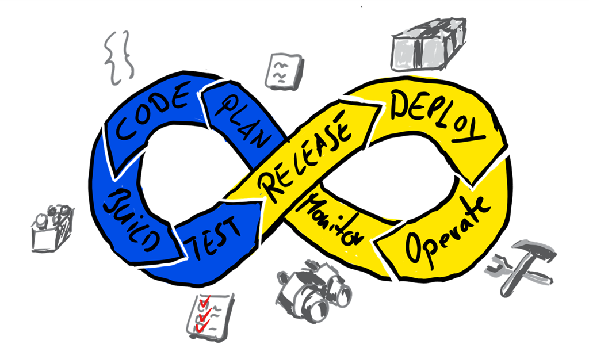

# DevOps

### ¿Pero qué es DevOps? 
DevOps es un término surgido de la combinación de “desarrollo” y “operaciones” (en inglés development y operations) que representa una filosofía de ingeniería que consiste en el enfoque colaborativo entre el equipo de (Dev) desarrollo de software y el de (Ops) operación del software. 

En su significado más amplio, DevOps es una cultura. Lo que se quiere conseguir con este tipo de metodología es aumentar la comunicación y confianza entre los desarrolladores y los administradores de sistemas, es decir, integrar los departamentos de operaciones y desarrollo. 

### Modelo DevOps
Con un modelo DevOps el proceso de desarrollo, desde la idea hasta el software en producción, proporciona a las organizaciones un incremento en la capacidad de organización a la hora de desarrollar una aplicación y, como consecuencia, ofrece un incremento en la velocidad y valor añadido que permite a las empresas competir de manera más eficiente. 

### Prácticas de DevOps
Para establecer una correcta unión entre desarrollo y operaciones, los DevOps tienen que llevar a cabo diferentes técnicas específicas. Algunas de las más recomendadas para la implementación de los conceptos anteriormente mencionados son: la integración y despliegue continuo, APIs o microservicios, monitorización, sistemas como código, comunicación y colaboración. Con todo ello,  los ingenieros de desarrollo y operaciones serán mucho más eficientes a la hora de trabajar en cualquier proyecto y, por ende, hará que sea más rápido desarrollar el conjunto global de la aplicación.

### Ventajas de utilizar DevOps
Como adelantábamos antes, aplicar la metodología DevOps en una empresa traerá muchos beneficios a la hora de trabajar y crear herramientas aplicando las metodologías agile. 

- Comunicación y colaboración: La piedra angular de aplicar correctamente la metodología DevOps es una buena comunicación y colaboración entre los desarrolladores y operadores (e incluso otros equipos), estableciendo un flujo de trabajo que mejore la productividad y los procesos de entrega del software mediante compilaciones, validaciones y despliegues. 

- Velocidad: Otro de los beneficios es la entrega de actualizaciones frecuentes, lo cual genera menos tiempos de inactividad y, sobre todo, permite resolver problemas en un menor tiempo. Las prácticas de DevOps ayudan a desarrollar y mejorar el producto más rápidamente, lo cual afecta directamente a su comercialización, siendo una ventaja competitiva.

- Agilidad: El desarrollo utilizando metodologías ágiles se complementa con la filosofía DevOps para optimizar todo el ciclo de desarrollo del software hasta su despliegue, haciendo hincapié en el desarrollo iterativo, incremental y evolutivo; combinándolo con el aprovisionamiento de infraestructura, la monitorización continua y las aplicaciones de soporte en un entorno de producción. Todo ello de forma automatizada.

- Seguridad: Con el creciente número de amenazas o peligros, proteger la aplicación es uno de los aspectos más importantes. Con un modelo DevOps podemos utilizar un conjunto de herramientas para realizar pruebas de seguridad automatizadas e integradas con nuestro proceso de integración continua, asegurando la seguridad de nuestra plataforma. 

- Customer first: Gracias a las metodologías agile esto es más sencillo que nunca, ya que al estar continuamente integrando y desplegando, los cambios en los gustos de los clientes pueden ser detectados rápidamente, adaptando la aplicación a ellos de forma rápida y ágil.

### Cómo CI y CD mejoran tu ciclo de desarrollo
Las prácticas de DevOps, como la integración continua y la entrega continua, permiten a los equipos de DevOps realizar entregas de código de una forma rápida, periódica, segura y fiable.

La integración continua es una práctica de desarrollo de software ágil donde los cambios de código se introducen y se combinan en un repositorio común, verificando la consistencia de esa integración mediante pruebas automatizadas para detectar cualquier tipo de error en la aplicación.

Por otro lado, el despliegue continuo va un paso más allá, encargándose del despliegue del nuevo código así como del aprovisionamiento de cualquier infraestructura necesaria, todo de forma automatizada para hacer el proceso seguro, pudiendo incluso integrar una política de rollbackautomático si algo no va según lo previsto.

En resumen, el CI/CD permite a los equipos de DevOps validar y entregar con frecuencia aplicaciones al usuario final mediante la automatización durante el ciclo de vida de la aplicación, desde el desarrollo hasta el despliegue en producción. Entre las herramientas más comunes para CI, CD o ambas, se encuentran Jenkins o Spinnaker, así como las soluciones propias de las plataformas de control de versiones como Github actions o Bitbucket pipelines, por poner algunos ejemplos.

---
### Referentes DevOps:
- [Nana](https://www.youtube.com/watch?v=0yWAtQ6wYNM&list=PLy7NrYWoggjwV7qC4kmgbgtFBsqkrsefG)
- [bregman-arie](https://github.com/bregman-arie/devops-exercises.git)
- [MichaelCade](https://github.com/MichaelCade/90DaysOfDevOps)
- [Pelado Nerd](https://www.youtube.com/@PeladoNerd)
---
Nos vemos en la siguiente clase.
