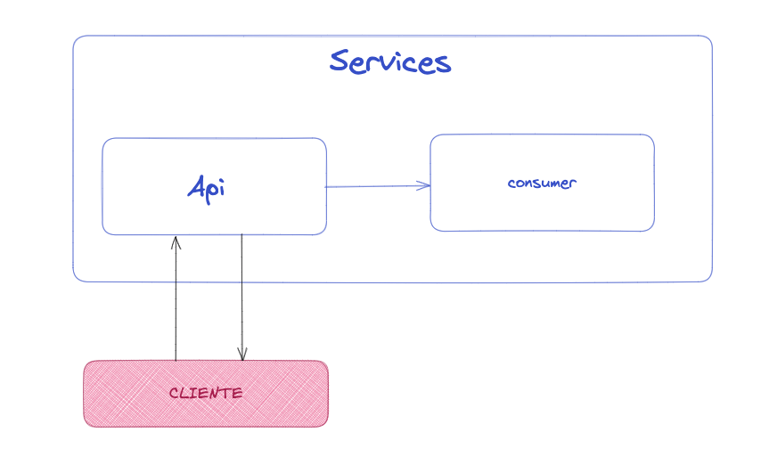

# Lab-05
---
## Contenerización la aplicación Flask y Consumer

Este ejemplo crea una API basica de flask, con un consumidor que accede desde el service de la API.

Lenguaje: Python
Version: >3.8

### Arquitectura



```
src
├── app
│   ├── app.py
│   └── templates
│       └── index.html
└── consumer
    └── consumer.py
```

## API flask

Puerto: 8000

#### Resultado API flask
curl localhost:8000
```
> curl localhost:8001
<!DOCTYPE html>
<html lang="en">
<body>

<h2>Hotname: e8a97746772c</h2>
<p>IP Address: 172.17.0.7</p>

</body>
</html>%  
```
#### Consumer

> host: service service-flask-app "Container_name"

Para el consumer es necesario las variables:
```
LOCAL=true
PYTHONUNBUFFERED="1"
``` 

#### Resultado consumer
```
Run container on local
Response OK!!!
Response OK!!!
Response OK!!!
Response OK!!!
Response OK!!!
```

### Entrega
- Documentación
- Print de pantalla con los resultados.
- Dockerfile API y Consumer
- Subir la Api y consumer a Docker-hub
- Docker-compose.yml