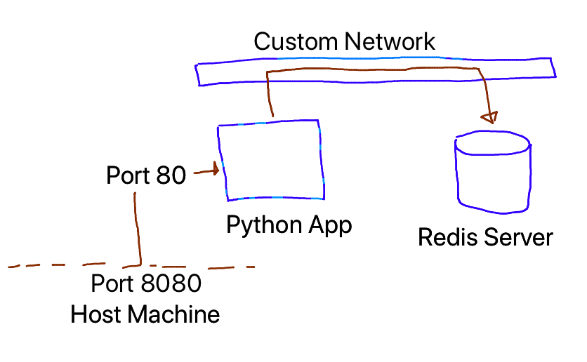
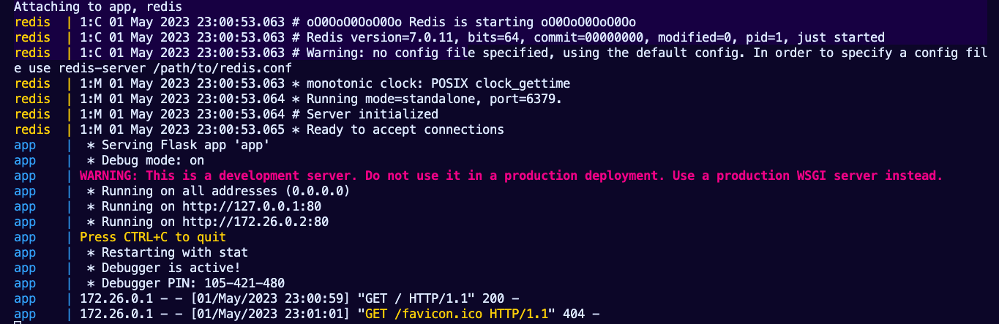

# Lab-08 
---
#### Docker Compose [Python Redis]

La empresa ZERO Technology, solicita al Equipo de DevOps Trainer, la contenerizacion de su aplicacion "Python"

### Entrega

- Se debe Armar un Docker-Compose 
- Se recomienda revisar el app.py como será la comunicacion con la redis.
- Documentación

