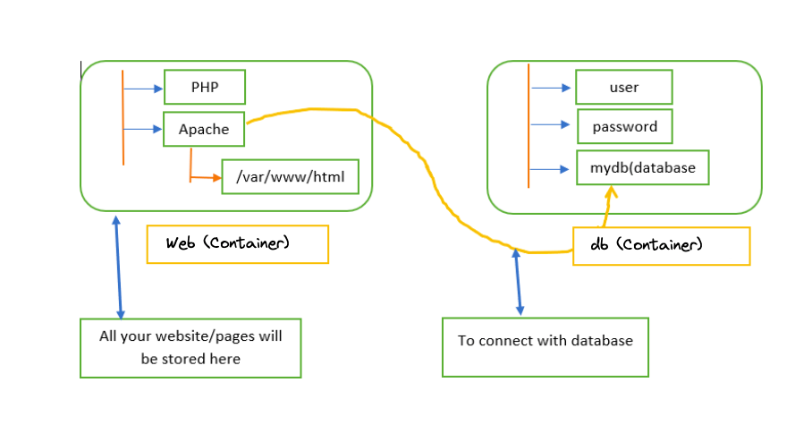

# Lab12 by RoxsRoss |III Edicion DevOps 2023

Tomando en cuanta el proyecto de la Clase-2 [Linux] vamos a desplegar el proyecto lamp-ecommerce en contenedores [lamp-app-ecommerce](../../../CLASE-02/lamp-app-ecommerce/README.md)

Por lo que necesitamos un contenedor para la aplicacion "Recuerden que usa PHP" y ademas podemos usar el servicio web Apache o su competencia nginx.

Es importante que tome en cuenta el uso de la base de datos "mysql" ó "mariadb" *bases de datos relacionales*

### Arquitectura 

### Entrega

- Documentación
- Print de Pantalla de la solución
- Dockerfile
- Docker-compose