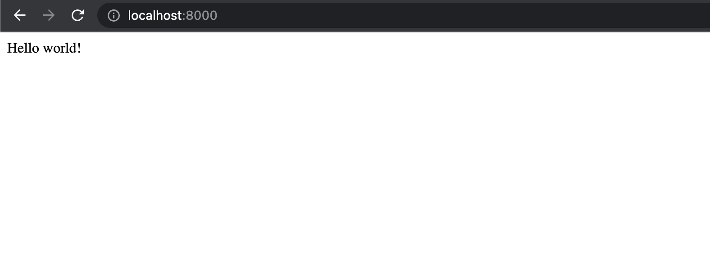
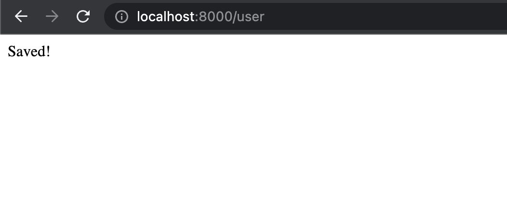
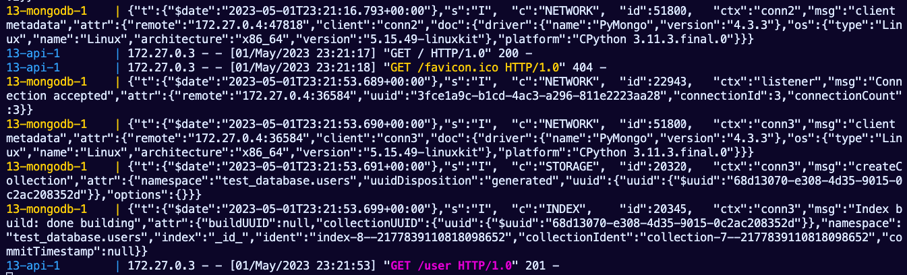
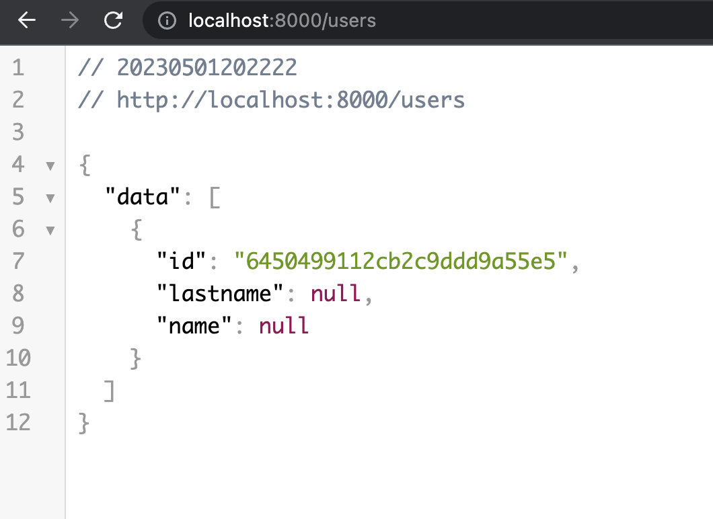

# lab-13 
---

## flask-mongodb-nginx-docker

Ejercicio de python con flask, mongoDB y nginx, todos en contenedores de Docker

### Como funciona:

Usa el puerto 8080 
/ Muestra *hello world*
/user para guardar sesion en base de datos mongo *mensaje saved*
/users para listar todas las sesiones

### Resultados

### Entrega

- Documentación
- Print de Pantalla de la solución
- Dockerfile
- Docker-compose
