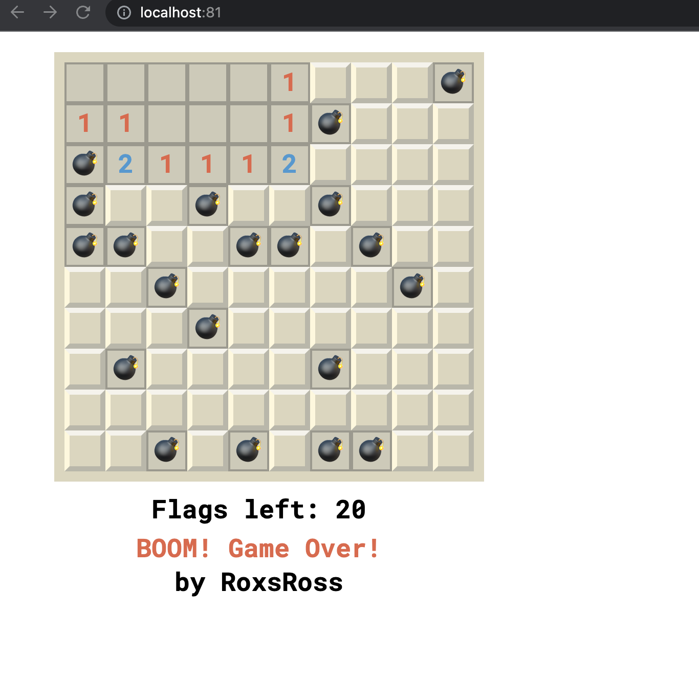

# lab-16
# Dockerizando Minesweeper [Buscaminas] by RoxsRoss

Jugar al buscaminas es nuestra pasión. 
¡Por eso nos esforzamos por convertirlo en el mejor juego del mundo!

¡La Dificultad es Aleatoria para desafiarte a ti mismo y disfruta del juego!

Usamos JavaScript 

El tablero está dividido en celdas, con minas distribuidas al azar. Para ganar, debes abrir todas las celdas que no contienen minas. Al hacer clic en una celda que no tiene una mina, se revela un número. Este número es la cantidad de celdas vecinas que contienen una mina. Con esta información, puedes determinar las celdas que son seguras y las celdas que contienen minas. Las celdas sospechosas de contener minas se pueden marcar con una bandera usando el botón derecho del ratón.

### Entrega

- Documentación
- Print de Pantalla de la solución
- Dockerfile
- Docker-compose

#### Vamos onfire 16 Challende de Docker 
