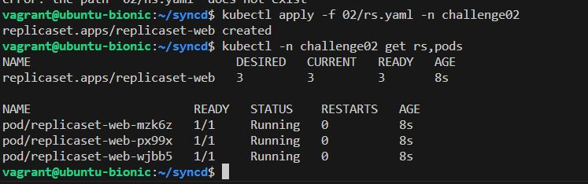
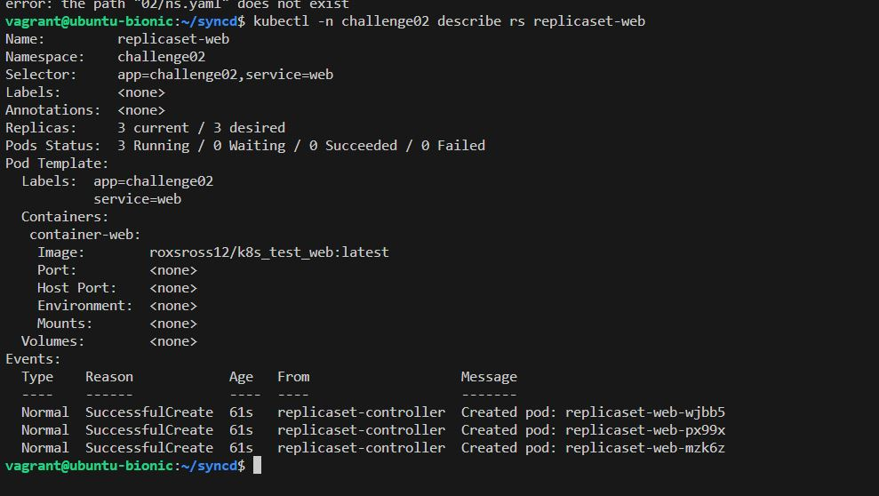
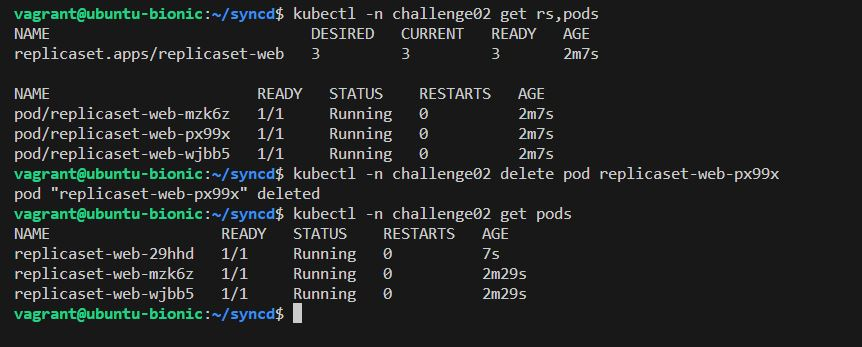
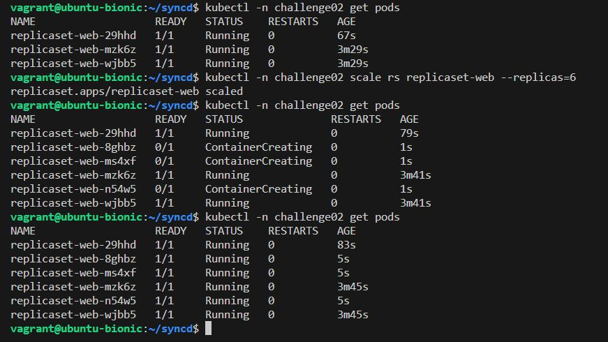

# **Challenge02**

> Resultados al realizar challenge 02 \
[bash](./02challenge.sh)

## **Resultados**

1. ***Archivo `.yaml` que has creado con la definición del ReplicaSet.***
[rs.yaml](./rs.yaml)
2. ***Imagen donde se comprueba que el ReplicaSet y los 3 Pods se han creado.***

3. ***Imagen donde se ve la información detallada del ReplicaSet.***

4. ***Imagen donde se ven los Pods que se han creado, después de eliminar uno de ellos.***

5. ***Imagen donde se ven los Pods que se han creado después del escalado.***
