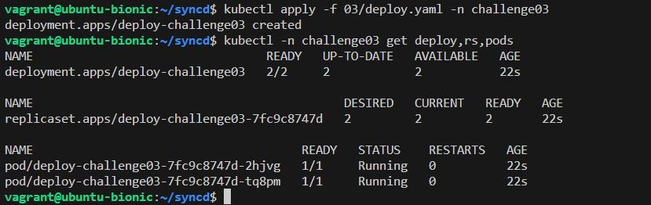
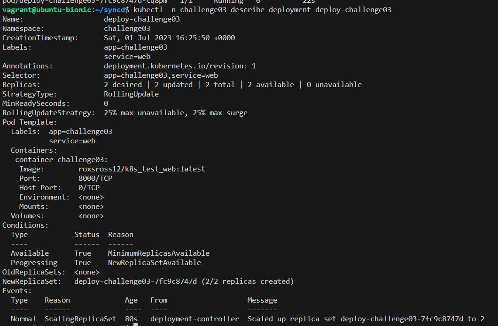
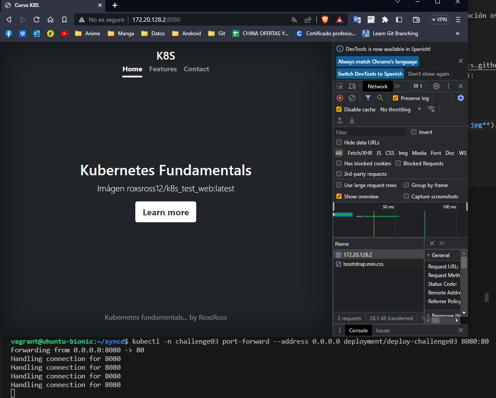
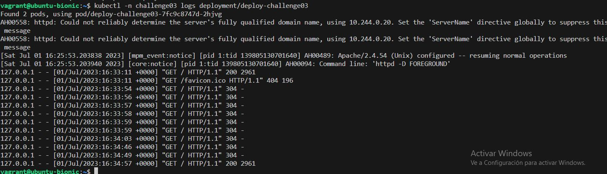

# **Challenge03**

> Resultados al realizar challenge 03 \
[bash](./03challenge.sh)

## **Resultados**

1. ***Archivo `.yaml` que has creado con la definición del Deploy.***
[deploy.yaml](./deploy.yaml)
2. ***Imagen donde se comprueba los recursos que se han creado.***

3. ***Imagen donde se ve la información detallada del Deployment.***

4. ***Imagen donde se vea el acceso desde un navegador web a la aplicación usando el `port-forward`***

5. ***Imagen donde se vea los logs del despliegue después del acceso***
