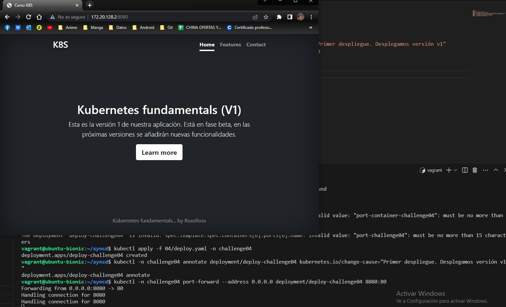
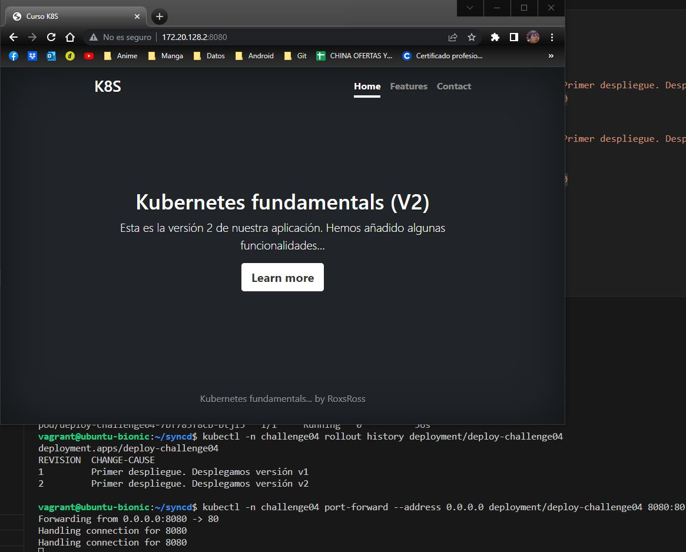
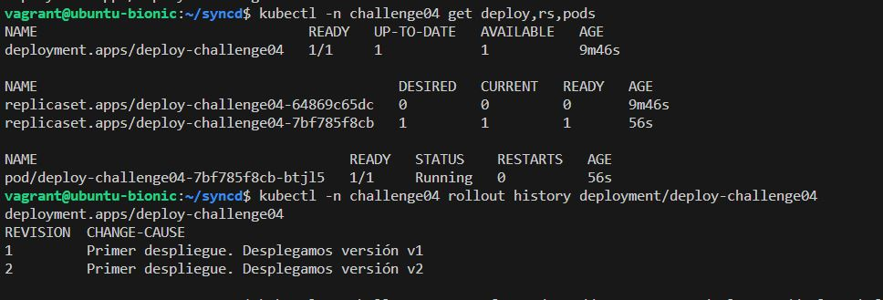
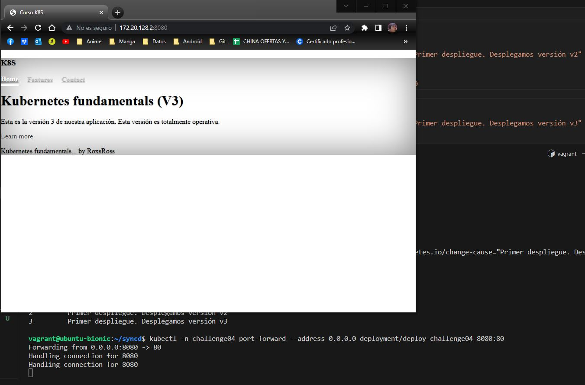
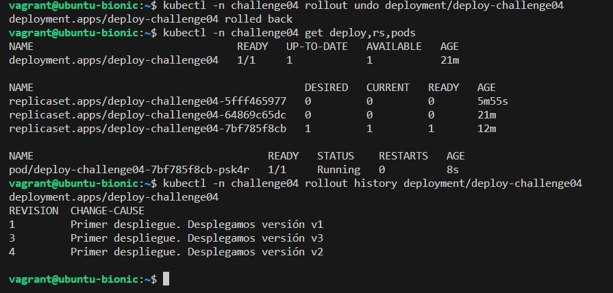
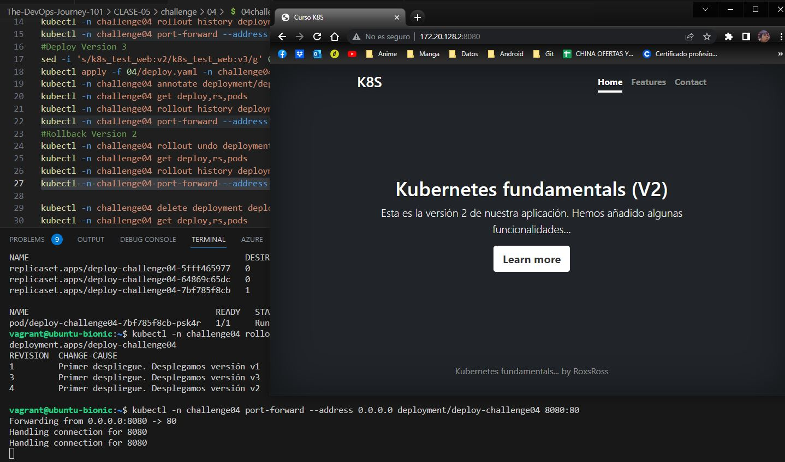

# **Challenge04**

> Resultados al realizar challenge 04 \
[bash](./04challenge.sh)

## **Resultados**

1. ***Archivo `.yaml` que has creado con la definición del Deploy.***
[deploy.yaml](./deploy.yaml)
2. ***Imagen donde se vea el acceso desde un navegador web a la version 1 de la aplicación aplicación.***

3. ***Imagen donde se vea el acceso desde un navegador web a la version 2 de la aplicación aplicación.***

4. ***Imagen donde se visualice el historial de actualización del despliegue después de actualizar a la versión 2.***

5. ***Imagen donde se vea el acceso desde un navegador web a la version 3 de la aplicación.***

6. ***Imagen donde se visualice el historial de actualización después de realizar el `rollback` del despliegue.***

7. ***Imagen donde se vea el acceso desde un navegador web a la version de la aplicación que queda después de hacer el rollout.***
