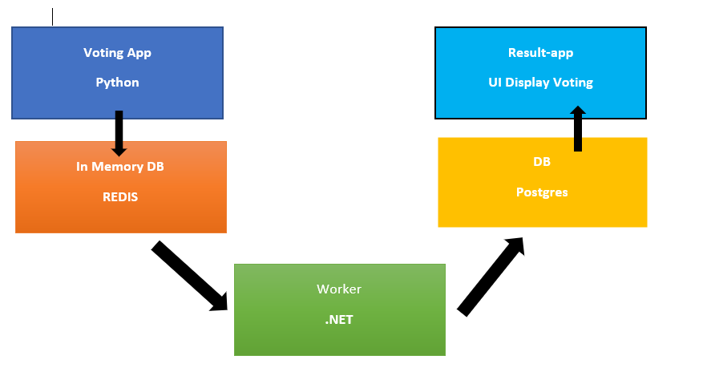

# LAB-06

### arquitectura de microservicios de kubernetes

En la siguiente arquitectura de microservicios de kubernetes, verá una aplicación en la que vota y el resultado se mostrará en función de los votos y, a continuación, se encuentran los componentes:

- *Aplicación de votación* basada en Python, que es una aplicación basada en UI donde agregará su voto.
- *Aplicación In Memory* basada en Redis que almacenará su voto en la memoria.
- *La aplicación Worker* , que es una aplicación basada en .net, convierte los datos de la memoria integrada en Postgres DB.
- *La aplicación Postgres DB* , que se basa en Postgres DB, recopila los datos y los almacena en la base de datos.
- *La aplicación de resultados* , que es una aplicación basada en la interfaz de usuario, obtiene los datos de la base de datos y muestra el voto a los usuarios.

---
Codigo Fuente Sección Docker [Codigo](../../../CLASE-04/Challenge/12/lab12.md)
 

Para superar el desafio deberás entregar en un unico repositorio de github en formato [markdown](https://docs.github.com/es/get-started/writing-on-github/getting-started-with-writing-and-formatting-on-github/basic-writing-and-formatting-syntax):

1. imagen donde se vea el acceso desde un navegador web a las aplicaciones  (**imagen1.jpg**).
2. imagen donde se vea el acceso desde un navegador web a la aplicación usando la ip del nodo master y el puerto asignado al Service (**imagen2.jpg**).
3. imagen donde se vea el acceso desde un navegador web a la aplicación usando el nombre que hemos configurado en el recurso Ingress (**imagen3.jpg**).

