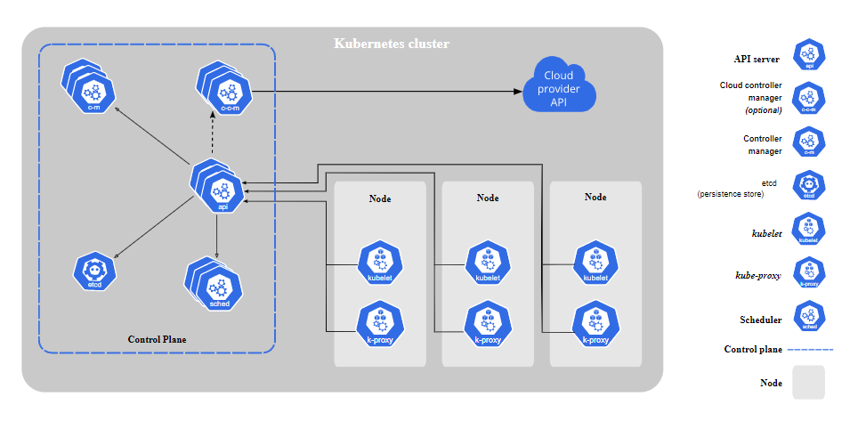

# Kubernetes

### ¿Qué es la orquestación de contenedores?
Antes de adentrarnos en Kubernetes primero de todo debes saber que es la orquestación de contenedores. Las tecnologías de contenedores han cambiado de forma radical el panorama de sistemas y la forma de empaquetar y desplegar el software. Algunos de los beneficios que aportan los contenedores son la portabilidad, la agilidad, la velocidad, la inmutabilidad, y el aislamiento de fallos.

Un orquestador de contenedores (en inglés container orchestration) es un software encargado de gestionar y coordinar contenedores de forma automatizada. Existen varias herramientas de orquestación de contenedores como Docker Swarm, Google Container Engine, Amazon ECS, y otras. Sin embargo, en este post nos centraremos en Kubernetes, donde explicaremos el concepto, componentes más destacables de la herramienta y discutiremos los beneficios que Kubernetes puede ofrecer, entre otros puntos.

### ¿Qué es Kubernetes?
Desarrollado originalmente por Google, Kubernetes, o k8s como se le conoce de forma abreviada, es una herramienta de orquestación de contenedores. Este sistema de código libre facilita el despliegue y el funcionamiento de las aplicaciones en una arquitectura de microservicios. Para ello, crea una capa de abstracción sobre un grupo de hosts, de modo que los equipos de desarrollo pueden desplegar sus aplicaciones y dejar que Kubernetes gestione el despliegue de contenedores.

[video](https://youtu.be/cC46cg5FFAM)

### Plataformas que ofrecen Kubernetes

Hay varias plataformas en la nube que ofrecen Kubernetes como servicio. Estas plataformas facilitan el trabajo al proporcionar una interfaz que facilita el despliegue de aplicaciones en Kubernetes sin tener que preocuparse por la configuración y gestión de los distintos componentes del clúster. Algunas de ellas son: Amazon EKS, Digitalocean, OpenShift o Rancher, entre otras.

### Arquitectura

### Elementos de los clústeres de Kubernetes
Kubernetes cuenta con una serie de características que permiten aprovisionar y desplegar tus propios programas de software en contenedores. Si eres nuevo en Kubernetes, la terminología puede ser novedosa, y requerir un aprendizaje extra. A continuación te explicamos algunos elementos básicos: 

*Pods:* La unidad mínima que se puede desplegar con Kubernetes. Cada pod puede contener de uno a varios contenedores que se ejecutan sobre los mismos recursos de almacenamiento/red compartidos del pod.

*Nodes:* Una máquina física o virtual que aloja los pods que desempeñan la carga de trabajo de una aplicación. 

*Control plane:* El plano de control ejecuta los componentes de Kubernetes que proporcionan las funcionalidades principales: exponer la API de Kubernetes, programar los despliegues de las cargas de trabajo, gestionar el clúster y dirigir las comunicaciones en todo el sistema. 

*Cluster:* Grupo de nodos que trabajan juntos, los cuales ejecutan aplicaciones en contenedores. Los clústeres están formados por los nodos maestro y trabajador. Pueden existir uno o más nodos maestros y cero o más nodos trabajadores. Por ejemplo, puedes tener varios nodos en el mismo clúster ejecutando los mismos contenedores. 

*Deployment:* Los despliegues de Kubernetes definen la escala a la que se desea ejecutar la aplicación permitiendo establecer los detalles de cómo se quiere que se repliquen los pods en los nodos de Kubernetes. Los despliegues describen el número de réplicas de pods idénticos que se desea ejecutar y la estrategia de actualización preferida para actualizar el despliegue, entre otros aspectos. Kubernetes hará un seguimiento de la salud de los pods, y eliminará o añadirá pods según sea necesario para llevar el despliegue de la aplicación al estado deseado. El despliegue proporciona una capa de abstracción que permite que los pods puedan ser reemplazados de manera sencilla y transparente. Los pods de un despliegue pueden estar ubicados en diferentes nodos.

*Service:* Un conjunto de pods que ejecutan la misma aplicación o microservicio pueden agruparse para formar un despliegue, como ya hemos visto. Puesto que estos pods pueden ser reemplazados y, debido a la naturaleza dinámica de Kubernetes, las diferentes direcciones IPs de los pods van a ir cambiando; surge la necesidad de que exista un recurso de red que permita establecer un punto de entrada a estos pods. Un servicio abstrae la complejidad de red subyacente, permitiendo ofrecer un punto único de entrada, invariable, y haciendo a su vez transparente la disposición de los pods que componen el despliegue.

*Ingress controller:* Es un software que proporciona la funcionalidad de proxy inverso, el enrutamiento del tráfico configurable y la terminación de TLS para los servicios de Kubernetes. Se instala un controlador de entrada en el clúster y, a continuación, se configuran unas reglas de entrada para un servicio o servicios concretos.

*Kubectl:* interfaz de línea de comandos que envía una solicitud a la API de Kubernetes, ya sea con órdenes específicas, con el contenido de un manifiesto YAML, o con peticiones de obtención de datos.

*Kubelet:* es un servicio que se ejecuta dentro de cada nodo, y que se comunica con el plano de control. 

*Existen otros componentes de Kubernetes como daemonsets, namespaces, replicaSets, secrets e incluso recursos personalizados. Los que se mencionan aquí son con los que más probablemente interectuarás al desplegar aplicaciones en Kubernetes.*

Si estás utilizando o considerando utilizar contenedores para hacer más eficiente la construcción, el escalado y el despliegue de tu aplicación basada en microservicios, Kubernetes te ofrece la posibilidad de gestionar la infraestructura mediante archivos YAML declarativos.

La gestión del ciclo de vida de los contenedores con Kubernetes utilizando sus implementaciones y operadores junto con un enfoque de DevOps permite que el desarrollo de software y las operaciones de TI se adapten para respaldar el canal de CI/CD. 

### Material complementario y Herramientas

- [100DaysOfKubernetes](https://100daysofkubernetes.io/)
- [kubectl Cheat Sheet](https://kubernetes.io/docs/reference/kubectl/cheatsheet/)
- [kubenetes from scratch by Elman ](./kubenetes-from-scratch.pdf)
- [Validar Objetos de kubernetes con validkube](https://validkube.com/)
- [Diseñar Arquitectura K8S con mingrammer ](https://diagrams.mingrammer.com/)
- [Ejemplo usando mingrammer](https://diagrams.mingrammer.com/docs/getting-started/examples#exposed-pod-with-3-replicas-on-kubernetes)