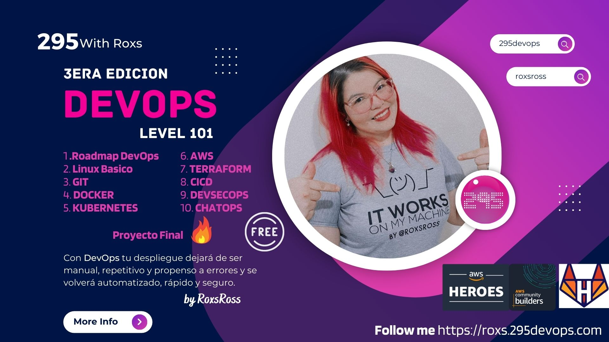

# DevOps 2023 Level 101 | The DevOps Journey 🔥 🔥 
### by @roxsross

### ¿Pero qué es DevOps? 
DevOps es un término surgido de la combinación de “desarrollo” y “operaciones” (en inglés development y operations) que representa una filosofía de ingeniería que consiste en el enfoque colaborativo entre el equipo de (Dev) desarrollo de software y el de (Ops) operación del software. 

En su significado más amplio, DevOps es una cultura. Lo que se quiere conseguir es aumentar la comunicación y confianza entre los desarrolladores y los administradores de sistemas, es decir, integrar los departamentos de operaciones y desarrollo.

 
 
 
En la III Edición, tu despliegue dejará de ser manual, repetitivo y propenso a errores y se volverá automatizado, rápido y seguro.
 
 
 
 

### Contenidos && Challenge

  1. Roadmap DevOps
        * [Intro DevOps](./CLASE-01/devops.md)

    
  1. Linux Básico 
        * [Linux](./CLASE-02/linux.md)
        * [Comandos Basicos](./CLASE-02/comandos_linux.properties)
        * [Bash](./CLASE-02/00_tutorial_bash/readme.md)
        * [Explicacion basica de bash](./CLASE-02/Explicacion-basica-bash.md)
        * [Challenge-01](./CLASE-02/05-example/reto1.md) 
        * [Challenge-02](./CLASE-02/05-example/reto2.md)
        * [Challenge-03](./CLASE-02/05-example/reto3.md)
        * [Ejercicios-1](./CLASE-02/ejercicios-scripts-linux-1.md)
        * [Ejercicios-2](./CLASE-02/ejercicios-scripts-linux-2.md)  
        * [Ejercicios-3](./CLASE-02/ejercicios-scripts-linux-3.md)  
        * [Ejercicios-4](./CLASE-02/ejercicios-scripts-linux-4.md)    

  1. Sistema de Control de Version
        * [Git](./CLASE-03/00-git-terminal-basico/00-configuracion.md)
        * [Comandos Basicos](./CLASE-03/github-git-cheat-sheet.pdf)
        * [Git DevOps](./CLASE-03/00-git-terminal-basico/05-ejercicio.md)
        * [Challenge-01](./CLASE-03/Ejercicios-github-bash/README.md) 

  1. Docker
        * [Libro Docker](./CLASE-04/Ebook%20-%20Fundamentos%20de%20docker.pdf)
        * [Cheat Sheet Docker](./CLASE-04/docker_cheatsheet.pdf)
        * [Comandos Basicos](./CLASE-04/Docker/01-Comandos-docker.md)
        * [Trabajando con Imagenes](./CLASE-04/Docker/02-Creacion-images.md)
        * [Trabajando con Imagenes2](./CLASE-04/Docker/03-Trabajando-con-imagenes.md)
        * [Volumenes-Redes](./CLASE-04/Docker/04-Volumenes-Redes.md)
        * [Volumenes](./CLASE-04/Docker/05-Volumenes.md)
        * [Redes](./CLASE-04/Docker/06-Redes.md)
        * [Docker-compose](./CLASE-04/Docker/07-DockerCompose.md)
        * [Docker-compose2](./CLASE-04/Docker/08-Docker-Compose-yml.md)
        * [Ejemplo1](./CLASE-04/Docker/Ejemplo-DockerCompose-php.md)
        * [Ejemplo2](./CLASE-04/Docker/Ejemplo-Guestbook.md)
        * [Ejemplo3](./CLASE-04/Docker/Ejemplo-Wordpress-Compose.md)
        * [Tips](./CLASE-04/Docker/10-Tips.md)
        * [Challenge-01](./CLASE-04/Challenge/01/lab-01.md) 
        * [Challenge-02](./CLASE-04/Challenge/02/lab-02.md) 
        * [Challenge-03](./CLASE-04/Challenge/03/lab-03.md)   
        * [Challenge-04](./CLASE-04/Challenge/04/lab-04.md) 
        * [Challenge-05](./CLASE-04/Challenge/05/lab-05.md)
        * [Challenge-06](./CLASE-04/Challenge/06/lab-06.md)    
        * [Challenge-07](./CLASE-04/Challenge/07/lab-07.md) 
        * [Challenge-08](./CLASE-04/Challenge/08/lab-08.md) 
        * [Challenge-09](./CLASE-04/Challenge/09/lab-09.md)   
        * [Challenge-10](./CLASE-04/Challenge/10/lab-10.md) 
        * [Challenge-11](./CLASE-04/Challenge/11/lab-11.md)
        * [Challenge-12](./CLASE-04/Challenge/12/lab-12.md)  
        * [Challenge-13](./CLASE-04/Challenge/13/lab-13.md) 
        * [Challenge-14](./CLASE-04/Challenge/14/lab-14.md)   
        * [Challenge-15](./CLASE-04/Challenge/15/lab-15.md)             
  1. Kubernetes
        * [Sobre Kubernetes](./CLASE-05/readme.md)
        * [Kubernetes](./CLASE-05/kubernetes/01/introk8s.md)
        * [Pod](./CLASE-05/kubernetes/02/pod.md)
        * [Replicaset](./CLASE-05/kubernetes/03/rs.md)
        * [Deployment](./CLASE-05/kubernetes/04/gestionando_deploy.md)
        * [Service](./CLASE-05/kubernetes/06/svc.md)
        * [Ingress](./CLASE-05/kubernetes/06/ingress.md)
        * [Namespaces](./CLASE-05/kubernetes/05/ns.md) 
        * [Minikube-Vagrant-K8s](./CLASE-05/minikube-k8s-vagrant/uso-vagrant-minikube.md) 
        * [Recursos](./CLASE-05/recursos/)    
        * [Challenge-01](./CLASE-05/challenge/01/lab01.md) 
        * [Challenge-02](./CLASE-05/challenge/02/lab02.md)
        * [Challenge-03](./CLASE-05/challenge/03/lab03.md)
        * [Challenge-04](./CLASE-05/challenge/04/lab04.md)
        * [Challenge-05](./CLASE-05/challenge/05/lab05.md)
        * [Challenge-06](./CLASE-05/challenge/06/lab06.md)
        * [Challenge-07](./CLASE-05/challenge/07/lab07.md)
        * [Challenge-08](./CLASE-05/challenge/08/lab08.md)           

  1. AWS
        * [Intro AWS]()
        * [AWS S3]()
        * [AWS EC2]()
        * [AWS Lambda]()  
        * [Challenge-01]() 
        * [Challenge-02]()
        * [Challenge-03]()   

  1. Terraform
        * [Intro Terraform]()
        * [Comandos]()  
        * [Challenge-01]() 
        * [Challenge-02]()
        * [Challenge-03]()   

  1. CICD
        * [CICD]()
        * [CICD Tools]()  
        * [Challenge-01]() 
        * [Challenge-02]()
        * [Challenge-03]() 

  1. DevSecOps
        * [Intro DevSecOps]()
        * [SAST]()  
        * [DAST]() 
        * [Challenge-01]()
        * [Challenge-02]()   

  1. ChatOps
        * [Intro ChatOps]()
        * [Tools]()  
        * [Challenge-01]() 

  1. Challenge Final
        * [Challenge onfire v1 🔥](./DESAFIO-ONFIRE-2023/Challenge-onfire-v1-level100/Readme.md)
        * [Challenge onfire v2 🔥🔥](./DESAFIO-ONFIRE-2023/Challenge-onfire-v2-level200/README.md)
        * [Challenge onfire v3 🔥🔥🔥](./DESAFIO-ONFIRE-2023/Challenge-onfire-v3-level300/Readme.md)

  1. Recursos & Material de Referentes DevOps
        * [Proximamente]() 

_ _ _

#### 🔔 Importante: Se actualiza contenido a medida que avance el curso de DevOps 101
_ _ _

## Contribuciones
Como siempre, cualquier contribución es bienvenida, simplemente forkeá este repo y enviame una PR.  

### **Puedes Seguirme** 🔥 &nbsp;

